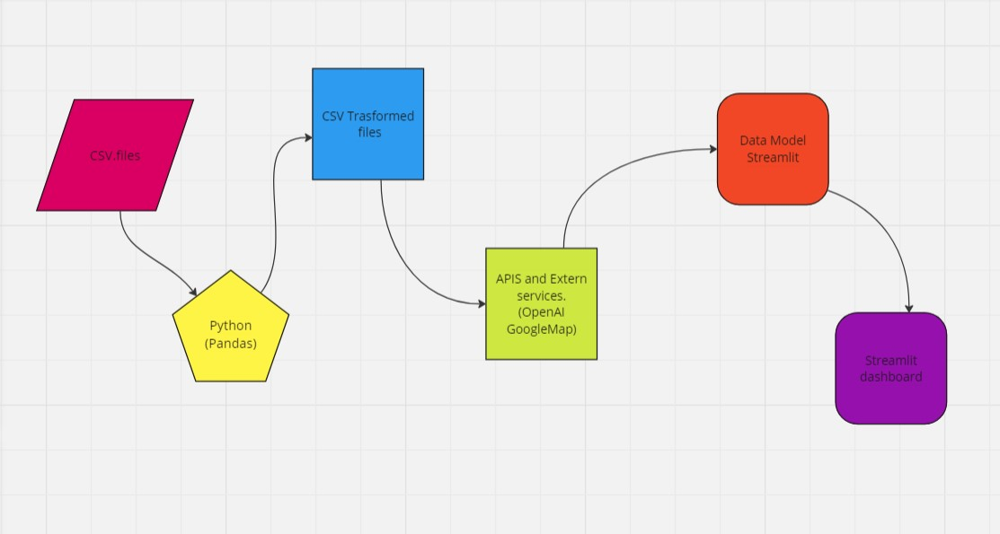
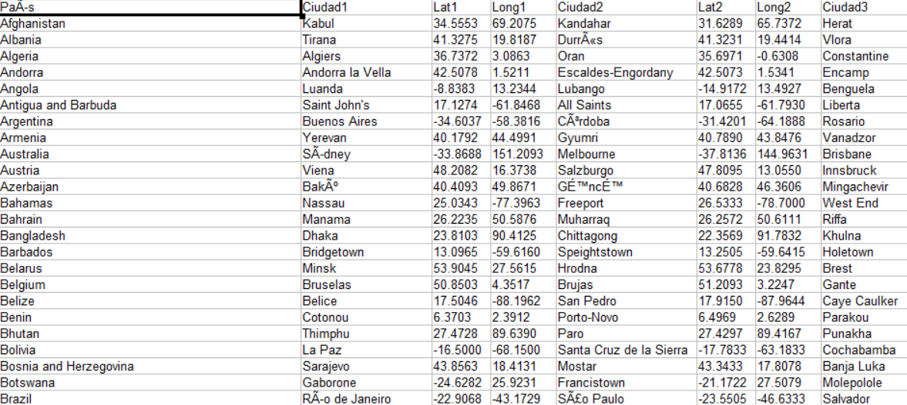
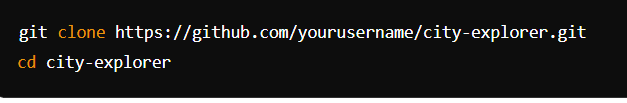
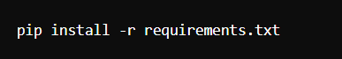
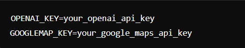
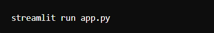

# viajemos_final_project

## Who has not hesitated when taking a trip? / ¿Quien no ha dudado a la hora de hacer un viaje?

viajemos_final_project is a web app built with Streamlit that allows users to explore cities around the world, discover popular landmarks, and find activities to do. This way you will have an easier time choosing your travel destination. It integrates with the OpenAI API to provide descriptions and recommendations of cities and with the GoogleMaps API where the monuments that must be visited will be marked.

viajemos_final_project es una aplicación web creada con Streamlit que permite a los usuarios explorar ciudades de todo el mundo, descubrir puntos de referencia populares y encontrar actividades para realizar. De esta manera tendras más fácilelegir tu destino de viaje. Se integra con la API de OpenAI para proporcionar descripciones y recomendaciones de ciudades y con la API de GoogleMaps en donde se marcaran los monumentos que se tienen que visitar.

The project is still in its development phase, I still have many ideas to implement, such as writing a PDF with the monuments that are chosen, creating routes in the GoogleMap API.

El proyecto se encuentra aún en su fase de desarrollo, aún tengo muchas ideas que implementar como redactar un pdf con los monumentos que se elijan, crear rutas en la API de GoogleMap.

## Index / Índice

*  Title and cover image / Título e imagen de portada

*  Index / Índice

*  Features / Caracteristicas.

*  Data Architecture Scheme / Esquema de la Arquitectura de datos.

*   CSV.

*   Installation / Instalación.

*  Usage / Uso.

*  Project access / Acceso al proyecto.

*  Technologies Used / Tecnologías usadas.

*  Creator of the project / Persona_Desarrollador del proyecto.

*  Contributions / Contribuciones.

### Features / Caracteristicas.

* Country and City Selection: Users can select countries and cities from a dataset to explore.
* Interactive Maps: Utilizes Folium and Streamlit to display dynamic maps with markers for selected cities.
* City Descriptions: Generates descriptions of selected cities using OpenAI's language model.
* Landmark Recommendations: Provides recommendations for popular landmarks and activities based on user input.
* External Links: Offers quick access to external resources such as weather information and flight bookings.

* Selección de país y ciudad: los usuarios pueden seleccionar países y ciudades de un conjunto de datos para explorar.
* Mapas interactivos: utiliza Folium, Streamlit y API de GoogleMaps para mostrar mapas dinámicos con marcadores para ciudades seleccionadas.
* Descripciones de ciudades: genera descripciones de ciudades seleccionadas utilizando el modelo de lenguaje de OpenAI.
* Recomendaciones de lugares emblemáticos: proporciona recomendaciones de lugares y actividades populares según las aportaciones de los usuarios.
* Enlaces externos: ofrece acceso rápido a recursos externos, como información meteorológica y reservas de vuelos.

### Data Architecture Scheme / Esquema de la Arquitectura de datos.

### CSV.

### Installation / Instalación.

* Clone the repository:
  
 

* Install dependencies:
  
  

* Set up environment variables:

    - Create a .env file in the root directory.
    - Add your API keys:
    - 
 
      

* Run the application:
  
  

### Usage / Uso.

* Find out which country is right for you right now.
* Select one or more countries and cities from the dropdown menus.
* Click on "Generate City Descriptions" to retrieve information about selected cities.
* Explore landmarks and activities recommended by the application.
* Use the links provided to visit external resources for weather updates, flight bookings, and currency conversion.

* Descubre que país es adecuado para ti en este momento.
* Selecciona uno o más países y ciudades de los menús desplegables.
* Haga clic en "Generar descripciones de ciudades" para recuperar información sobre las ciudades seleccionadas.
* Explora puntos de referencia y actividades recomendadas por la aplicación.
* Utilice los enlaces proporcionados para visitar recursos externos para obtener actualizaciones meteorológicas, reservas de vuelos y conversión de moneda.

### Project access / Acceso al proyecto.

* enlace aplicacion.

### Technologies Used / Tecnologías usadas.

* Python
* Streamlit
* Pandas
* Folium
* OpenAI API
* GoogleMap API
* Geopy.

### Creator of the project / Persona_Desarrollador del proyecto.

El desarrollador de este proyecto es Mario Sánchez Cantero.

Email - sanchezcanteromario@gmail.com

Project Link: https://github.com/Mariosc87/viajemos_final_project

### Contributions / Contribuciones.

Contributions are welcome! Here's how you can contribute:

* 1- Fork the repository
* 2- Create your feature branch (git checkout -b feature/AmazingFeature)
* 3- Commit your changes (git commit -m 'Add some amazing feature')
* 4- Push to the branch (git push origin feature/AmazingFeature)
* 5- Open a pull request 
Please make sure to update tests as appropriate.

Las contribuciones son bienvenidas! Así es como puedes contribuir:

* 1- Bifurcar el repositorio
* 2- Crea tu rama de funciones (git checkout -b feature/AmazingFeature)
* 3- Confirma tus cambios (git commit -m 'Agrega alguna característica sorprendente')
* 4- Empujar a la rama (función de origen de git push/AmazingFeature)
* 5- Abrir una solicitud de extracción 
Asegúrese de actualizar las pruebas según corresponda.
